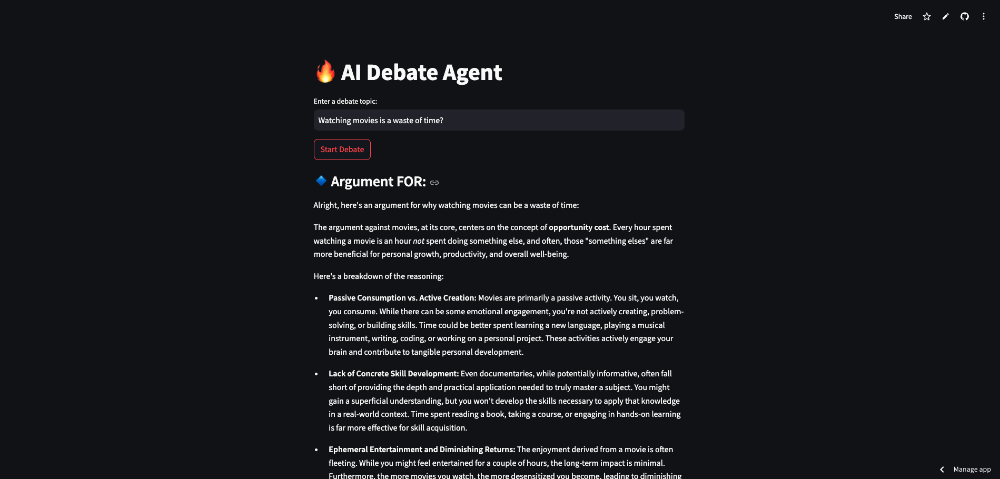
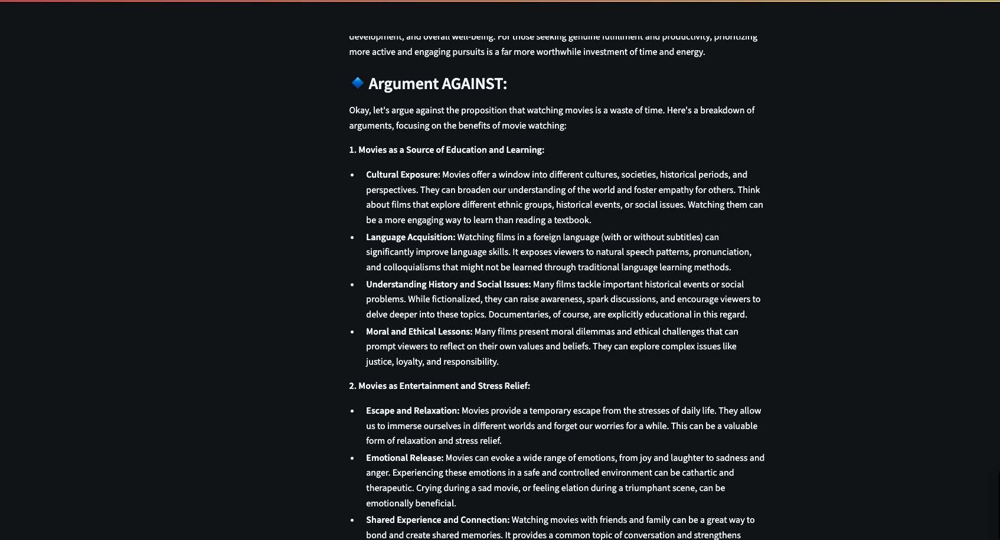

# 🔥 AI Debate Agent

🚀 **Live Demo:** [Click Here to Try the AI Debate Agent](https://ai-debate-agent-rby4ux2agtw4yxkrlgmkp8.streamlit.app/)

## 📌 Overview

AI Debate Agent is an LLM-powered app that can argue **for** and **against** any topic dynamically. It leverages **Google Gemini 2.0 Flash** for reasoning and argument generation.

## ⚡ Features

✅ Accepts any debate topic from the user  
✅ Generates structured arguments **for & against** the topic  
✅ Uses **LLM fine-tuning (Gemini API)** for intelligent responses  
✅ Hosted on **Render (Backend) & Streamlit Cloud (Frontend)**

## 📸 Demo Screenshot




## 🔧 Tech Stack

- **Backend:** FastAPI, Uvicorn, Google Gemini API
- **Frontend:** Streamlit
- **Deployment:** Render (Backend), Streamlit Cloud (Frontend)

## 🚀 How to Run Locally?

### 1️⃣ Clone the Repo

```bash
git clone https://github.com/yourusername/AI-Debate-Agent.git
cd AI-Debate-Agent
```

### 2️⃣ Setup Backend

```bash
cd backend
python3 -m venv venv
source venv/bin/activate  # On Windows use `venv\Scripts\activate`
pip install -r requirements.txt
uvicorn app:app --reload
```

### 3️⃣ Setup Frontend

```bash
cd ../frontend
pip install -r requirements.txt
streamlit run ui.py
```

### 🎯 Future Improvements

Add memory for longer debates
Enable user feedback to improve AI responses
Support multiple AI models (e.g., GPT, Claude)

### 🤝 Contributing

Pull requests are welcome! Open an issue if you have ideas.

### 📧 Contact

✉️ Email: kvk1011@gmail.com
🔗 LinkedIn: [LinkedIn](https://www.linkedin.com/in/k-vignesh-kumar/)
